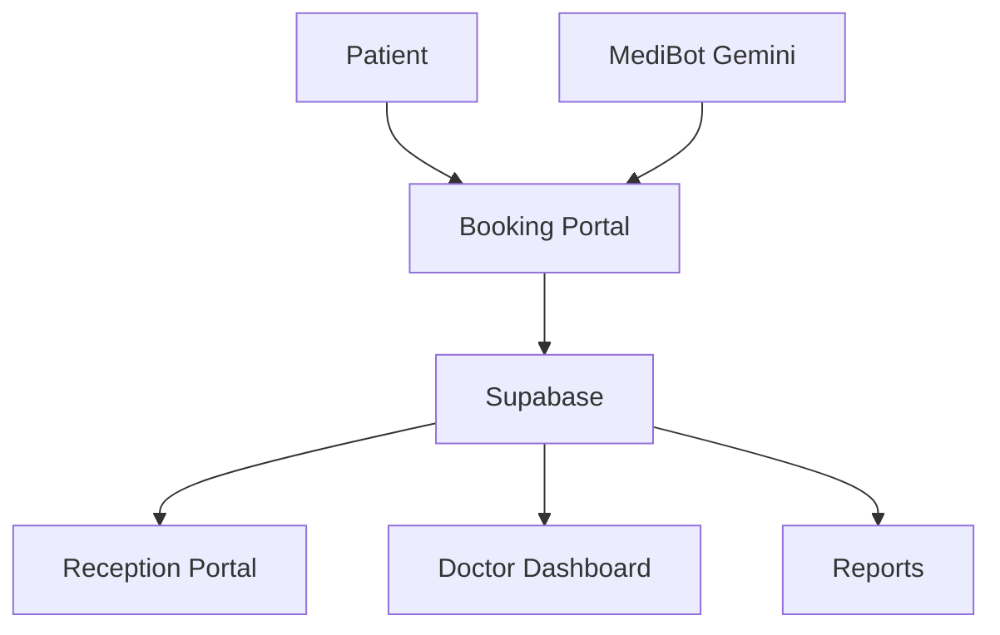

🩺 MediConnect – Intelligent Healthcare Scheduling & Workforce Platform
Theme 6: Booking, Scheduling & Workforce (Healthcare)

MediConnect is a cloud-powered healthcare scheduling and workforce management platform designed to streamline appointment booking, reception operations, doctor workflows, and clinic capacity management.

The platform enables patients, receptionists, and doctors to work through a unified system while maintaining real-time visibility of appointments and clinic operations.

🚀 Problem Statement

Many clinics still rely on phone calls, spreadsheets, and manual registers to manage appointments and daily operations.

This creates challenges such as:

Appointment scheduling conflicts
Manual coordination between reception and doctors
Limited visibility into clinic workload
Long patient waiting times
Inefficient workforce utilization
Lack of centralized appointment tracking

These issues reduce operational efficiency and negatively impact patient experience.

💡 Solution

MediConnect digitizes the complete clinic appointment workflow from booking to consultation completion.

The platform provides:

Online appointment booking
Reception workflow management
Doctor appointment dashboards
Cloud-based appointment persistence
Workforce visibility and capacity monitoring
AI-powered healthcare assistant
✨ Key Features
👤 Patient Features
Online appointment booking
Service selection
Doctor allocation
Appointment status tracking
AI-powered assistance through MediBot

🏥 Reception Features
Reception login portal
Appointment management
Request → Confirm → Arrived workflow
Appointment deletion and updates
Live operational visibility

👨‍⚕️ Doctor Features
Secure doctor login
Doctor-specific appointment dashboard
Date-wise appointment filtering
Consultation completion workflow
Daily capacity monitoring
Patient reminder management

🤖 MediBot AI Assistant

MediBot is an AI-powered healthcare assistant integrated into the platform.

Capabilities:

Clinic information assistance
Service guidance
Appointment support
Doctor information
Contact information
Healthcare workflow assistance

Medical safety guardrails are implemented to prevent diagnosis or prescription generation.

📊 Analytics & Insights

Appointment analytics
Service demand tracking
Capacity utilization monitoring
Clinic workload visibility
Operational reporting

🔄 Workflow

Patient Books Appointment
           ↓
Stored in Supabase
           ↓
Reception Reviews Request
           ↓
Appointment Confirmed
           ↓
Patient Arrives
           ↓
Doctor Consultation
           ↓
Appointment Completed

☁️ Architecture

Patient Portal
      ↓
Supabase Database
      ↓
Reception Portal
      ↓
Doctor Dashboard
      ↓
Reports & Analytics

🏗️ System Architecture
┌─────────────────┐
│     Patient     │
└────────┬────────┘
         │
         ▼
┌─────────────────┐
│ Appointment UI  │
└────────┬────────┘
         │
         ▼
┌─────────────────┐
│    Supabase     │
│ Cloud Database  │
└──────┬─────┬────┘
       │     │
       ▼     ▼

┌───────────┐  ┌─────────────┐
│Reception  │  │   Doctor    │
│  Portal   │  │ Dashboard   │
└─────┬─────┘  └──────┬──────┘
      │               │
      └───────┬───────┘
              ▼

      ┌─────────────┐
      │  Analytics  │
      │ & Reports   │
      └─────────────┘

              │
              ▼

      ┌─────────────┐
      │  MediBot AI │
      │   Gemini    │
      └─────────────┘

🛠 Tech Stack

Frontend
React.js
Vite
Tailwind CSS
Backend & Database
Supabase
AI
Google Gemini API
MediBot AI Assistant
Deployment
Netlify

## Architecture

⚙️ Local Setup
npm install
npm run dev

🌐 Deployment

Live Demo:

https://mediconnect26.netlify.app/

GitHub Repository:

https://github.com/KartheekAlapati/mediconnect-takeover26

🔮 Future Scope

WhatsApp notification integration
Multi-clinic support
Electronic Medical Records (EMR)
Advanced workforce optimization
Predictive scheduling analytics
Insurance integration

👥 Team Kurukshetra

Kartheek

Lead, Product Development, Deployment

Avinash

Backend & Database

Sai Venkat

Backend & Workflow

Akash

Research & Validation

Charith

Testing & Documentation